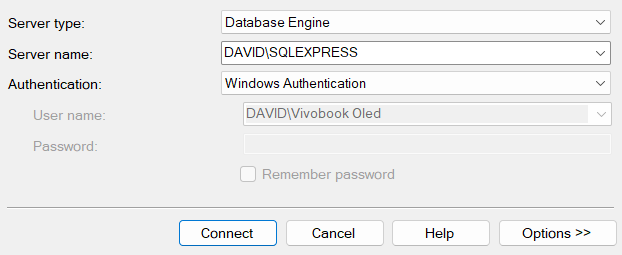

# Empleados-ASP.NET

Este proyecto es un crud de dos entidades mediante la tecnologia ASP .NET y razor pages.

## Requisitos Previos

Asegúrate de tener instalados los siguientes componentes antes de ejecutar la aplicación:

1. **Microsoft SQL Server**: Necesitarás una instancia de SQL Server para la base de datos de tu aplicación. Puedes descargar SQL Server desde [Microsoft SQL Server Downloads](https://www.microsoft.com/sql-server/sql-server-downloads). Recuerda descargar la version ***Express***

2. **Microsoft SQL Server Management Studio (SSMS)**: SSMS es una herramienta gráfica para administrar y trabajar con SQL Server. Puedes descargar SSMS desde [SQL Server Management Studio (SSMS)](https://docs.microsoft.com/en-us/sql/ssms/download-sql-server-management-studio-ssms).

## Configuración de la Base de Datos

1. **Conexión a SQL Server**: Abre SSMS y conecta a tu instancia de SQL Server. Tienes que usar la autenticación de Windows.

<p align="center">
  
</p>

2. **Actualizar la Cadena de Conexión**: Abre el archivo `appsettings.json` en tu proyecto ASP.NET Core y copia la cadena de conexión con la información correcta para tu base de datos.

```json
"ConnectionStrings": {
    "ConexionSqlServer": "Server=TuServidor;Database=AppEmpleados;Trusted_Connection=True;MultipleActiveResultSets=true;TrustServerCertificate=true;"
},
```
En **Server** vas a poner el nombre del **Server Name** como indico en la foto
