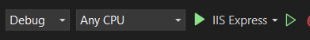

# Empleados-ASP.NET

Este proyecto es un crud de dos entidades ```Departamento``` y ```Empleado``` el empleado depende de los departamentos. Esta realizado mediante la tecnologia ASP .NET y razor pages. Cabe recalcar que este proyecto se ejecuta en Visual Studio.

## Requisitos Previos

Asegúrate de tener instalados los siguientes componentes antes de ejecutar la aplicación:  
1. [Microsoft Visual Studio 2022 Community](https://visualstudio.microsoft.com/) en tu máquina.
En el Visual Studio Installer agrega el paquete **Desarrolló de escritorio de .NET** e instalalo.  

2. **Microsoft SQL Server**: Necesitarás una instancia de SQL Server para la base de datos de tu aplicación. Puedes descargar SQL Server desde [Microsoft SQL Server Downloads](https://www.microsoft.com/sql-server/sql-server-downloads). Recuerda descargar la version ***Express***

3. **Microsoft SQL Server Management Studio (SSMS)**: SSMS es una herramienta gráfica para administrar y trabajar con SQL Server. Puedes descargar SSMS desde [SQL Server Management Studio (SSMS)](https://docs.microsoft.com/en-us/sql/ssms/download-sql-server-management-studio-ssms).

## Configuración de la Base de Datos

1. **Conexión a SQL Server**: Abre SSMS y conecta a tu instancia de SQL Server. Tienes que usar la autenticación de Windows.

<p align="center">
  
</p>

2. **Actualizar la Cadena de Conexión**: Abre el archivo `appsettings.json` en tu proyecto ASP.NET y copia la cadena de conexión con la información correcta para tu base de datos.

```json
"ConnectionStrings": {
    "ConexionSqlServer": "Server=TuServidor;Database=AppEmpleados;Trusted_Connection=True;MultipleActiveResultSets=true;TrustServerCertificate=true;"
},
```
En **Server** vas a poner el nombre del **Server Name** como indico en la foto.

3. **Creacion de Tablas**: Con el proyecto abierto vas a ir a la seccion de **Herramientas** a la opcion **Administrador de paquetes NuGet** y escogeras **Consola del Administrador de paquetes** aqui se abrira una terminal donde dijitaras el siguiente comando.
``` update-database ``` esto creara toda las tablas de la base de datos.

4. **Depuracion**: Una vez hecho todos los pasos previos vas a dar en el boton de play con la opcion del depurador **ISS Express**.

<p align="center">
  
</p>

## Extensiones Utilizadas
En caso de algun problema voy a dejar una lista con las extensiones que utiliza el programa, ya estan instaladas pero por si acaso ocurre algun fallo.
Primero vas a ir a la seccion de **Herramientas** a la opcion **Administrador de paquetes NuGet** y escogeras **Administrar Paquetes NuGet para la solucion** aqui vas a verificar o instalar los siguientes paquetes.
1. Microsoft.EntityFrameworkCore
2. Microsoft.EntityFrameworkCore.SqlServer
3. Microsoft.EntityFrameworkCore.Tools
